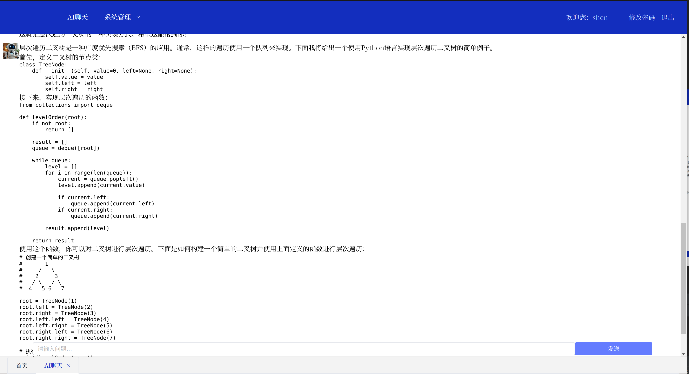

算法小生云前端服务

### 1. node版本

v18.20.1

### 2. 用户名密码

admin 1

### 3. 截图展示

详见 https://blog.csdn.net/SJshenjian/article/details/139395203

### 4. 新增AI聊天

TODO
1. 流式输出支持，后端已开发好
2. 新增markdown支持
3. 页面优化

欢迎关注公众号 算法小生，欢迎提交代码~~

